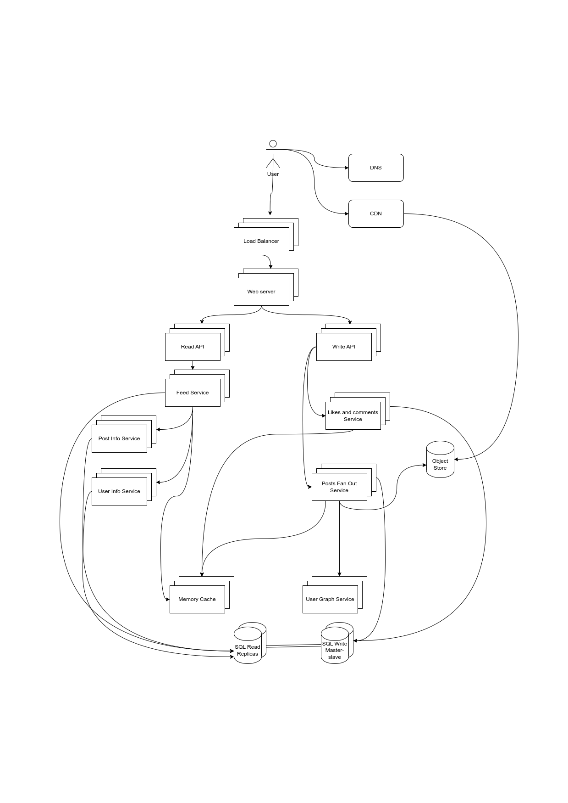

# Homework 7 - High Load Applications Architecture

## Use cases and constraints:

### Use cases:

- User publishes a post (with photo or video)
- User views other user
- User views the home feed (activity from people the user is following)
- User likes a post
- User comments a post

### Constraints and assumptions:
 
General

- Traffic in not evenly distributed (e.g. for users with big amount of followers)
- Publishing a post should be fast
- 100m daily active users
- 500m daily posts

Feed

- Viewing home feed should be fast
- Read heavy

## High level design

## Design Core Components

### Use case: User publishes a post (with photo or video)

1. User sends a request to create a post
2. Request is forwarded to **Web Server** through **Load Balancer**
3. Request is forwarded to **Write API** through **Web Server**
4. **Write API** contacts the **Posts Fan Out Service**, which does the following:
    - Stores a Post in **SQL storage**
    - Queries the **User Graph Service** to find the user's followers stored in the **Memory Cache**
    - Stores the post in the home feed of the user's followers in a **Memory Cache**
    - Stores media in the **Object Store**

### Use case: User likes a post or posts a comment

1. User sends a request to create a post
2. Request is forwarded to **Web Server** through **Load Balancer**
3. Request is forwarded to **Write API** through **Web Server**
4. **Write API** contacts the **Likes and Comments Service**, which does the following:
    - Stores a like/comment in the **SQL Storage**
    - Updates **Memory cache** if needed

### Use case: User views other user timeline

1. User sends a request to create a post
2. Request is forwarded to **Web Server** through **Load Balancer**
3. Request is forwarded to **Read API** through **Web Server**
4. **Read API** contacts the **Feed Service**, which does the following:
    - Get the user's posts from **SQL Read Replica**
    - Queries the **Post Info Service** a multiget to obtain additional info about the posts
5. The media of the posts might be delivered from CDN

### Use case: User views the home feed

1. User sends a request to create a post
2. Request is forwarded to **Web Server** through **Load Balancer**
3. Request is forwarded to **Read API** through **Web Server**
4. **Read API** contacts the **Feed Service**, which does the following:
    - Get the home feed from **Memory Cache** if possible (or recreates one from the **SQL Read Replica**)
    - Queries the **Post Info Service** a multiget to obtain additional info about the posts
    - Queries the **User Info Service** a multiget to obtain additional info about the users, who published the post
5. The media of the posts might be delivered from CDN

## Possible Bottlenecks and SPOFs

### Bottlenecks

- **Posts Fanout Service**: can be a pottential bottleneck for users which have lots of followers
- **Likes and comments Service**: because of often occurances (related to posts) of likes and comments, this service might be a bottlneck. We can introduce some queue-based service for batch processing and storing these kind of entities

### SPOFs

- Load Balancer
- Web Server
